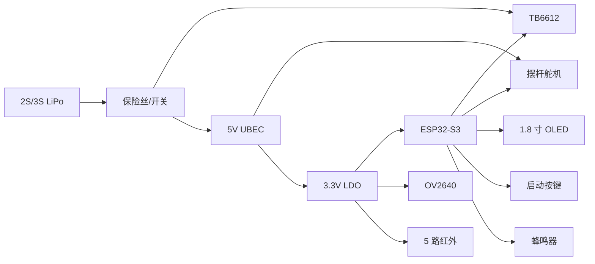

# 硬件框图

```mermaid
flowchart LR
  BAT[2S/3S LiPo] --> FUSE[保险丝/开关]
  FUSE --> MOTOR[TB6612]
  FUSE --> UBEC[5V UBEC]
  UBEC --> SERVO[摆杆舵机]
  UBEC --> LDO[3.3V LDO]
  LDO --> MCU[ESP32-S3]
  LDO --> CAM[OV2640]
  LDO --> IR[5 路红外]
  MCU --> MOTOR
  MCU --> SERVO
  MCU --> OLED[1.8 寸 OLED]
  MCU --> KEY[启动按键]
  MCU --> BUZ[蜂鸣器]
```

## 结构要点

- 摆杆左端铰链高度 ≥5 cm；
- 摆杆 25 cm，不超出车身；
- 摄像头固定在摆杆上方，画面覆盖 -6~+6 cm；
- 摄像头排线与电机线分开走；
- 电池置于车体中心附近，降低重心；
- 舵机连杆避免死点，留机械限位。
